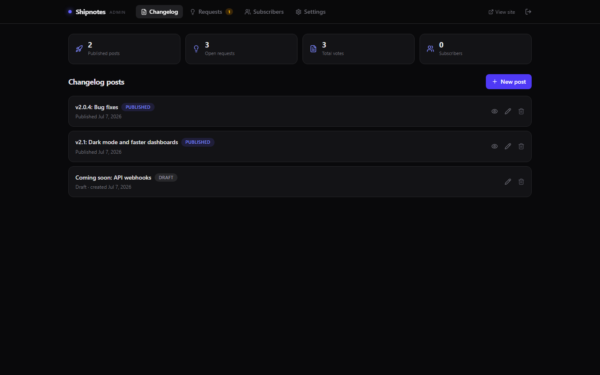

# 🚢 Shipnotes


**Self-hosted changelog + public roadmap + feature request board. Pay once, own it forever — no Canny subscription.**

Canny charges **$79/month** to show your users what you shipped and let them vote on what's next. Shipnotes does it on your own $5 VPS (or as a desktop app), with your data in a single SQLite file you actually own.



## Features

- 📰 **Public changelog** — write posts in Markdown, tag them `New` / `Improved` / `Fixed`, publish with one click
- 🗺️ **Public roadmap board** — Planned / In Progress / Shipped columns, sorted by votes
- 💡 **Feature requests** — visitors submit ideas and upvote (one vote per visitor, no account needed), with comment threads
- 🛡️ **Moderation** — approve, merge duplicates (votes carry over, deduped), or decline with a public reason
- 📧 **Email subscribers** — BYO SMTP; publishing a post emails every subscriber with a one-click unsubscribe link
- 📡 **RSS feed** — valid RSS 2.0 at `/rss.xml`
- 🔔 **Embeddable "What's new" widget** — one `<script>` tag adds a bell with an unread badge + dropdown of latest posts to any site
- 🎛️ **Admin dashboard** — dark, fast, keyboard-friendly; posts, requests, subscribers, settings
- 💾 **One SQLite file** — trivial backups, no external services, zero telemetry

## Quick start

```bash
npm i
npm run build   # builds the admin UI
npm start       # http://localhost:5311
```

- Changelog: `http://localhost:5311/`
- Roadmap: `http://localhost:5311/roadmap`
- Admin: `http://localhost:5311/admin` (default password `admin` — set `ADMIN_PASSWORD`)

### 🖥️ Desktop mode

Run it as a desktop app, or deploy to a $5 VPS when you need it public:

```bash
npm run desktop
```

Same app, wrapped in Electron — the server runs on a free local port, data lives in your OS user-data folder, and you're auto-logged-in as admin. `npm run dist` builds a Windows installer.

### 🐳 Docker

```bash
docker compose up -d
```

SQLite data persists in the `shipnotes-data` volume. Configure via `.env` (see `.env.example`).

### Embed the widget

```html
<script src="https://updates.yourapp.com/widget.js" defer></script>
```

Optional: `data-target="#my-button"` to attach to your own trigger, `data-accent="#22c55e"` to theme it.

## Tech stack

Node 20+ · Express · better-sqlite3 · React 18 (Vite) · Tailwind CSS 4 · Framer Motion · Lucide · marked · nodemailer · Electron (desktop mode)

## Shipnotes vs Canny

| | **Shipnotes** | **Canny** |
|---|---|---|
| Price | **$49 once** | $79/month ($948/yr) |
| Changelog | ✅ Markdown + tags + RSS | ✅ |
| Roadmap board | ✅ | ✅ |
| Feature requests + voting | ✅ | ✅ |
| Comment threads | ✅ | ✅ |
| Email notifications | ✅ BYO SMTP | ✅ |
| "What's new" widget | ✅ | ✅ (higher tiers) |
| Self-hosted / own your data | ✅ SQLite file | ❌ |
| Anonymous voting (no signup wall) | ✅ | ❌ |
| Telemetry | None | Their servers |
| Source code | MIT, yours | Closed |

**Canny pays for itself never. Shipnotes pays for itself in 19 days.**

## ☕ Skip the setup — get the 1-click installer

Don't want to touch a terminal? Grab the packaged installer (plus updates) on Whop:

**→ [https://whop.com/benjisaiempire/shipnotes](https://whop.com/benjisaiempire/shipnotes)**

## Testing

```bash
npm test
```

Boots the real server against a throwaway database and verifies the whole flow: post publishing, request moderation, one-vote-per-visitor (repeat = 409), RSS validity, subscribe/unsubscribe, and the widget endpoints.

## License

MIT © 2026 Ben (bensblueprints)
